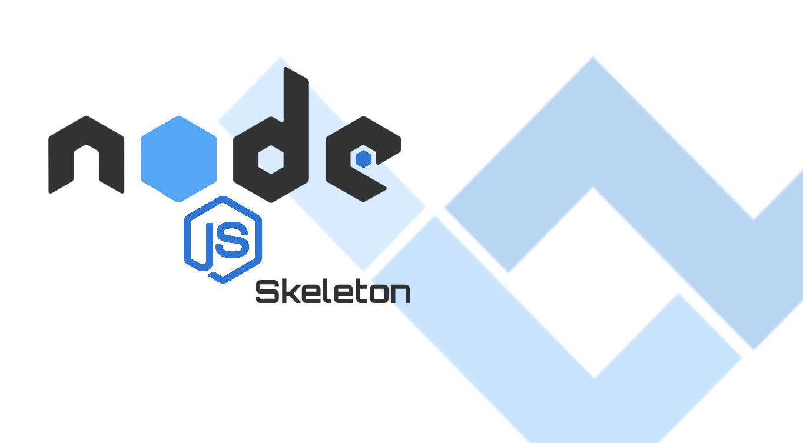

# WebbyLab's Node.JS Skeleton

1. Based on ideas of [Clean Architecture](https://blog.cleancoder.com/uncle-bob/2012/08/13/the-clean-architecture.html) and [DDD](https://dddcommunity.org/)
2. Well defined abstractions (controllers, use case layer, domain model etc).
3. Works for small and large projects
4. Follows [12 factor app](https://12factor.net/) approach
5. Modern JS (including ES6 for sequalize)
6. Supports both REST API and JSON RPC (WS)
7. Continuation Local Storaпe enabled by default for transactions and logs tracking 
8. Follows security best practices
9. [Docker](https://docs.docker.com/) support
10. Covered with tests
11. Battle tested
12. Built on top of [express.js](https://expressjs.com/)
13. User management out of the box **(in progress)**
14. SMTP support (with development and testing mocks)
15. Works in Linux, Mac, Windows
16. Automatically generate CRUD from Sequelize Model (Read more [here](./docs/CRUD_GENERATOR.md))

## TODO
1. Authtentication with different strategies (FB etc)
2. CQRS for reports out of the box
3. Add more secutiry features to eslint static analysis
4. Add GraphQL support
5. Split chistajs into seprate modules for RESTAPI/GraphQL/JSONRPC support

## LINKS

1. [en] The working Architecture of Node.js Applications (JSNation Conference 2019): https://www.youtube.com/watch?v=eVGdV53q68I
2. [ru] Effective NodeJS Application Development (FWDAYS'20): https://www.youtube.com/watch?v=g0I2dNwK1BE
3. [ru] 6 Ways to Hack Your JavaScript Application (JS Fest 2019 Spring): https://www.youtube.com/watch?v=tBXZRC1f34E

## REQUIREMENTS
* NodeJS v14+
* Docker v18+
* Docker Compose v1.23+

## RUN DEVELOPMENT VERSION
1. docker-compose -f docker/docker-compose.yml up
2. npm install
3. npm run migration:db
4. npm run migration:test
5. npm test
6. npm run nodemon

## RUN IN CONTAINER (DOCKER) (in progress)
1. make sure docker and docker-compose are installed
2. create .env file in project root directory (it could be empty)
3. run `docker-compose -f docker/docker-compose.yml -f docker/docker-compose.dev.yml up`

## SCRIPTS
* `nodemon` - runs app with nodemon
* `nodemon:docker` - runs app in container (docker)
* `start` - runs app with node (NODE_ENV=production)
* `test:lint` - runs eslint for: lib/, tests/, app.mjs
* `test:ava` - runs tests with [ava](https://github.com/avajs/ava)
* `test:coverage` - runs coverage test with [c8](https://github.com/bcoe/c8)
* `test:audit` - runs npm audit
* `test` - runs all tests: lint, audit, ava, coverage
* `create:admin` - creates new admin: npm run create:admin -- --email=your@email.com --password=password
* `migration:db` - runs sequelize migration with `--env db` parameter
* `migration:test` - runs sequelize migration with `--env test-db` parameter
* `generate` - generates folders/files from Sequelize Model