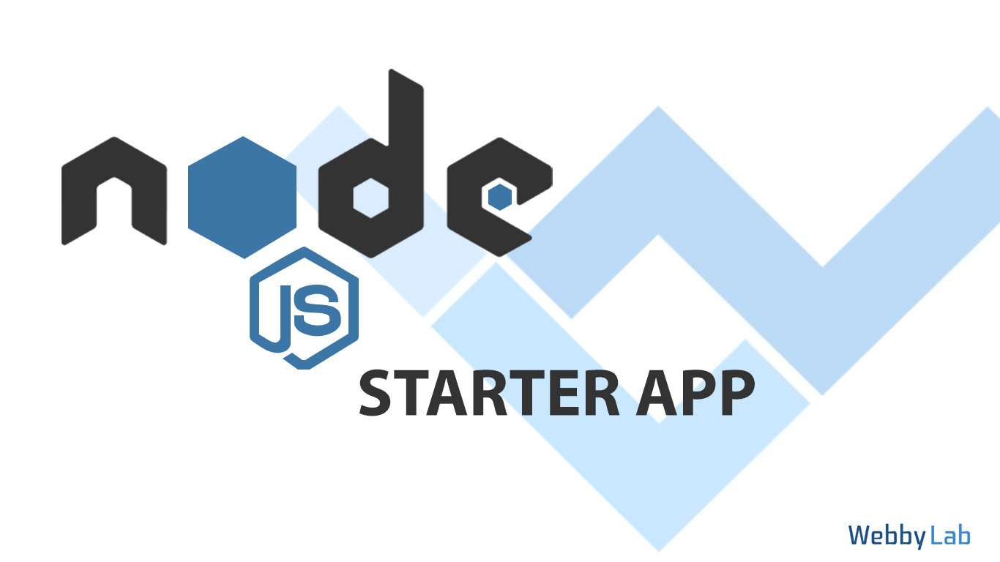

# WebbyLab's Starter App for Node.JS projects 

1. Based on ideas of [Clean Architecture](https://blog.cleancoder.com/uncle-bob/2012/08/13/the-clean-architecture.html) and [DDD](https://dddcommunity.org/)
2. Battle tested
3. Well defined abstractions (controllers, use case layer, domain model etc).
4. Works for small and large projects
5. Follows [12 factor app](https://12factor.net/) approach
6. EcmaScript Modules and latest JS features without transpiling 
7. ES6 classes for Sequalize out of the box
8. Supports both REST API and JSON RPC (WS)
9. Continuation Local Storage enabled by default for transactions and logs tracking 
10. Follows security best practices
11. [Docker](https://docs.docker.com/) support
12. Covered with tests (db dependent tests, code coverage etc)
13. Built on top of [express.js](https://expressjs.com/)
14. User management out of the box **(in progress)**
15. S3 support out of the box even for local development
16. SMTP support (with development and testing mocks)
17. Works in Linux, Mac, Windows
18. Automatically generate CRUD from Sequelize Model (Read more [here](./docs/CRUD_GENERATOR.md))
19. Paranoid eslint rules to cover all edge cases that we can with static analysis.

## TODO
1. Authtentication with different strategies (FB etc)
2. CQRS for reports out of the box
3. Add more secutiry features to eslint static analysis
4. Add GraphQL support
5. Split chistajs into seprate modules for RESTAPI/GraphQL/JSONRPC support

## RELATED CONFERENCE TALKS 

### In English:

* [The working Architecture of Node.js Applications (JSNation Conference 2019)](https://www.youtube.com/watch?v=eVGdV53q68I)

### In Russian:

* [Effective NodeJS Application Development (JavaScript FWDAYS'20)](https://www.youtube.com/watch?v=g0I2dNwK1BE)
* [The working Architecture of Web Applications (DevPoint 2019)](https://www.youtube.com/watch?v=TjvIEgBCxZo)

## REQUIREMENTS
* NodeJS v14+
* Docker v18+
* Docker Compose v1.23+

## RUN DEVELOPMENT VERSION
1. docker-compose -f docker/docker-compose.yml up
2. npm install
3. npm run migration:db
4. npm run migration:test
5. npm test
6. npm run nodemon

## RUN IN CONTAINER (DOCKER) (in progress)
1. make sure docker and docker-compose are installed
2. create .env file in project root directory (it could be empty)
3. run `docker-compose -f docker/docker-compose.yml -f docker/docker-compose.dev.yml up`

## SCRIPTS
* `nodemon` - runs app with nodemon
* `docker:dev:up` - starts app and infrastructure using docker-compose
* `docker:dev:down` - stops docker-compose from "docker:dev:up"
* `docker:up` - starts infrastructure (db, smtp-server, imageproxy, adminer, s3-server) using docker-compose
* `docker:down` - stops docker-compose from "docker:up"
* `start` - runs app with node (NODE_ENV=production)
* `test:lint` - runs eslint for: lib/, tests/, app.mjs
* `test:ava` - runs tests with [ava](https://github.com/avajs/ava)
* `test:coverage` - runs coverage test with [c8](https://github.com/bcoe/c8)
* `test:audit` - runs npm audit
* `test` - runs all tests: lint, audit, ava, coverage
* `create:admin` - creates new admin: npm run create:admin -- --email=your@email.com --password=password
* `migration:db` - runs sequelize migration with `--env db` parameter
* `migration:test` - runs sequelize migration with `--env test-db` parameter
* `generate` - generates folders/files from Sequelize Model